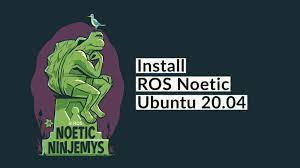

<p align="center"></p>
<h1 align="center"> ROS Noetic Install</h1> 
<h4 align="right">Jun 23</h4>


<br>
ROS Noetic install on Ubuntu 20.04

## Steps
Setup your computer to accept software from packages.ros.org.

```bash
sudo sh -c 'echo "deb http://packages.ros.org/ros/ubuntu $(lsb_release -sc) main" > /etc/apt/sources.list.d/ros-latest.list'
```
Set up your keys
```bash
sudo apt install curl # if you haven't already installed curl
curl -s https://raw.githubusercontent.com/ros/rosdistro/master/ros.asc | sudo apt-key add -
```
```bash
sudo apt update
```
Desktop-Full Install:
```bash
sudo apt install ros-noetic-desktop-full
```
ROS-Base (No GUI tools) 
```bash
sudo apt install ros-noetic-ros-base
```

link: http://wiki.ros.org/noetic/Installation/Ubuntu

<br>

# Workspace de ROS
### Configurar un nuevo workspace

Ejecute lo siguiente en un terminal (`Ctrl + Alt + T`). 

```bash
# añadira al final del archivo ~/.bashrc de nuestro sistema Linux la ruta de nuestro workspace
source /opt/ros/noetic/setup.bash

# Crear workspace.
mkdir -p ~/ros_ws/src && cd ~/catkin_ws/
catkin_make

# Agregamos el espacio de trabajo al archivo .bashrc. para que ROS reconozca nuestro espacio de trabajo cada vez que usemos el terminal
#echo /home/USUARIO/catkin_ws/devel/setup.bash >> ~/.bashrc, sino se debe correr source devel/setup.bash dentro del espacio de trabajo.
echo -e "\n# carjavi ROS Workspace" >> ~/.bashrc
echo "source $HOME/catkin_ws/devel/setup.bash" >> ~/.bashrc

# tambien se puede hacer desde GUI, en Home Ctrl + h muestra los archivos ocultos, abrimos el .bashrc y agregamos 
# source ~/catkin_ws/devel/setup.bash


```

## Initialize rosdep
```bash
sudo apt install python3-rosdep
sudo rosdep init
rosdep update
```

# Dependencies for building packages
```bash
sudo apt install python3-rosdep python3-rosinstall python3-rosinstall-generator python3-wstool build-essential
```

<br>
<br>

---
Copyright &copy; 2022 [carjavi](https://github.com/carjavi). <br>
```www.instintodigital.net``` <br>
carjavi@hotmail.com <br>
<p align="center">
    <a href="https://instintodigital.net/" target="_blank"></a>
</p>

